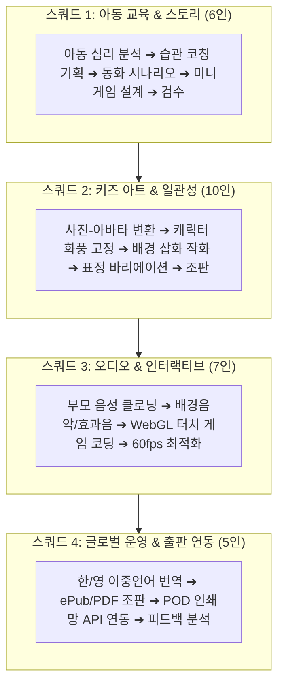
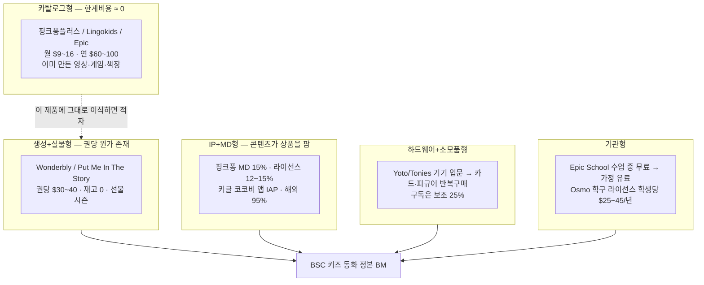

# 💡 맞춤형 인터랙티브 키즈 동화 플랫폼 (Interactive Kids Playbook)

> **문서 코드**: `BSC-IDEA-20260818-01`  
> **출처**: Google Gemini Spark 아이디어 × BSC 기획실  
> **일자**: 2026-08-18  
> **BM 개정**: 2026-08-20 (CFO 도현 · Assist PM 지윤)  
> **분류**: `1.지식창고 / 03.아이디어_뱅크 / 2026-08-18_맞춤형_인터랙티브_키즈_동화_플랫폼`  
> **기획 총괄**: PM 지윤 & 수석비서 소하  
> **패키지 인덱스**: `00_인덱스.md`  
> **후속 정본 (v2)**: `2026-08-20_맞춤형_인터랙티브_키즈_동화_플랫폼_아이디어_v2.md`  

---

## 🎨 1. 핵심 컨셉 (Concept)

> **"아이 사진 1장으로 동화 속 주인공이 되고, 부모의 목소리로 읽어주며, 터치 게임으로 올바른 생활 습관을 기르는 세상에 하나뿐인 인터랙티브 동화 플랫폼"**

아이의 실제 얼굴을 귀여운 2D 파스텔 화풍의 캐릭터로 변환하고, 학부모의 1분 목소리 녹음으로 AI 오디오북을 생성하며, 양치질·편식 개선 등 생활 습관을 인터랙티브 미니게임으로 체득하게 합니다.

---

## 🌟 2. 5대 킬러 기능 (Key Features)

1. **아바타 변환 (Face-to-Toon)**:
   - 아이 사진 1장 업로드 시, 따뜻한 수채화/파스텔 화풍의 2D 캐릭터로 자동 생성 (동화 전편에 걸쳐 일관된 표정과 외모 유지).
2. **습관 코칭 시나리오 생성 (Personalized Habit Story)**:
   - "양치질 싫어하는 민우", "채소 안 먹는 지아" 등 아이의 실제 생활 고민을 아동 심리 기법을 적용한 5~8페이지 흥미진진한 모험 스토리로 구성.
3. **인터랙티브 미니게임 (Interactive Play)**:
   - 동화 장면 중간에 직접 칫솔을 터치해 충치 괴물을 물리치거나, 채소 요정을 도와주는 인터랙티브 터치 인터랙션 삽입.
4. **부모 목소리 클로닝 (Parent Voice Cloning)**:
   - 부모가 스마트폰으로 1분간 짧은 문장을 읽으면, 음성 AI가 엄마/아빠의 다정한 목소리로 전체 동화를 따뜻하게 구연.
5. **실물 양장본 그림책 주문 (POD Print-on-Demand)**:
   - 디지털로 완성된 아이 맞춤형 동화책을 클릭 한 번으로 고품질 하드커버 양장본 그림책으로 인쇄·출판하여 집으로 배송.

---

## 👥 3. 28인 멀티에이전트 4대 제작 스쿼드 분업 구조

---

## 💰 4. 수익 모델 (Business Model)

> **개정.** 2026-08-20 · Owner 도현(CFO) · Assist 지윤(PM)  
> **근거.** 실제 키즈 앱·아동 타겟 기업 BM 대조 (Wonderbly, Lingokids, Epic, 핑크퐁, 키글, Yoto/Tonies, COPPA 2025)  
> **판정.** 초안 3종(구독·POD·유치원)은 방향은 맞으나, **생성형 AI 한계비용**과 **선물 구매 심리**를 반영하지 못해 마진이 무너질 구조다.

### 4-0. 초안 (2026-08-18) — 유지 기록

* **B2C 구독 플랜**
  - **Free Tier**. 월 2권 무료 생성 (기본 템플릿 + TTS)
  - **Family Premium (월 12,900원)**. 무제한 동화 생성 + 부모 목소리 클로닝 5인 + 인터랙티브 미니게임 무제한 + POD 20% 할인
* **POD 커머스 수익**
  - 실물 하드커버 양장본 포토 동화책 제작/배송 (판매가 19,800원 ~ 29,800원 / 마진율 50% 이상)
* **B2B 기관 라이선스**
  - 어린이집/유치원 원생 맞춤형 졸업/생일 동화책 대량 제작 패키지

### 4-1. 초안이 위험한 이유 (Evidence)

| 초안 가정 | 실제 시장 | 위험 |
| :--- | :--- | :--- |
| 월 2권 무료 생성 | Wonderbly는 무료책 없음. Lingokids 무료는 **이미 만든 카탈로그**만 | 생성 1권 COGS 약 ₩2,800~5,500. 무료 유저 1명당 월 최대 ₩11,000 적자 |
| 월 12,900원 무제한 | 핑크퐁플러스 월 $8.99·연 $59.99는 **기제작 콘텐츠** 무제한 | 생성형 무제한은 헤비유저 1명이 구독료를 초과 소진함 |
| 양장본 ₩19,800~29,800 / 마진 50%+ | Wonderbly 권당 **$30~40** (약 ₩42,000~55,000), 재고 0 POD | 국내 하드커버+배송만 ₩13,000~22,000. AI 원가 포함 시 50% 마진은 성립하지 않음 |
| 구독을 MVP부터 | Wonderbly는 **단건 선물 커머스**로 1,100만 권 판매 후 PRH 피인수. Lingokids는 다운로드 1.85억·유료전환 미공개·매출 85%가 Plus | 키즈 프리미엄 전환율 업계 약 16%. 구독은 습관 루프 증명 **이후** |
| 아동 대상 광고로 보완 가능 | FTC COPPA 개정(2025). 타깃광고·제3자 공유·**AI 학습용 아동 데이터**는 별도 부모 옵트인. 기한 2026-04-22 | 광고 BM은 이 제품에서 **폐기**. 얼굴 사진=생체정보 |

핵심 한 줄. **카탈로그 구독(핑크퐁·Epic)과 생성형+실물(Wonderbly)은 원가 구조가 다르다.** 이 아이디어는 후자이므로 MVP는 구독이 아니라 **단건+크레딧**이다.

### 4-2. 벤치마크 맵 (아이들이 쓰는 앱 vs 아이가 주인공인 상품)

| 기업/앱 | 아이 접점 | 실제 버는 곳 | 이 아이디어에 이식할 것 | 이식하지 말 것 |
| :--- | :--- | :--- | :--- | :--- |
| **Wonderbly** (舊 Lost My Name) | 이름·얼굴이 들어간 그림책 | D2C 단건 $30~40, 선물(생일·크리스마스), 카탈로그 150+종. 매출 약 £60m, 해외 75%. 2025 PRH 피인수 | **단건 히어로 SKU + 시즌 선물 + 재고 0 POD + 반복구매용 시리즈** | 앱 구독으로 시작 |
| **Lingokids** | 2~8세 게임·쇼 4,000+ | 매출 약 85%가 Plus 구독. 월 $15 / 연 $75~90. 다운로드 1.85억 vs 유료는 소수. 2025 Blippi·Disney IP 제휴(고정비 또는 RS) | **브랜드/IP 제휴를 광고가 아닌 콘텐츠 상품으로** | 무료 대량 뿌리고 전환을 운에 맡김 |
| **Epic!** | 책 4만 권 도서관 | Family 구독 + **School은 수업 중 무료**, School Plus는 교육청 예산 | **기관 낮 무료 → 가정 밤 유료** 퍼널 | 가정 구독만으로 기관 영업 |
| **핑크퐁플러스 / 더핑크퐁** | 유튜브 2.4억 구독자 | 2024 매출 구성 콘텐츠 61.6% · MD 15.3% · 라이선스 15.2%. 플러스 월 $8.99 / 연 $59.99. 2025 매출 939억·영업익 194억 | **광고 제거를 유료 가치로**, 이후 MD·라이선스 비중 확대 | 유튜브 조회수 BM을 앱에 복사 |
| **키글 코코비** | 병원놀이 등 앱 | 앱 IAP, 누적 매출 300억, **해외 95%** | 글로벌 단건/IAP, 로컬라이즈 | 국내 구독만 보고 시장 단정 |
| **Yoto / Tonies** | 스크린프리 오디오 | 기기는 입문, **카드·피규어가 이익**. Yoto Club 약 매출 25% | 양장본 속 **QR/NFC로 디지털 오디오·게임 언락** (하드웨어는 2년 차) | MVP에서 기기 제조 |
| **아이챌린지·교원** | 학습지 방문 | 월회비+교재 실물. 방문·실물이 이탈을 방어 | 실물책이 **리텐션 앵커** | 방문교사 조직 복제 |
| **Khan Academy Kids** | 무광고 학습 | 비영리 무료. 품질 평가는 구독앱보다 높은 편 | **무광고·COPPA 준수를 브랜드 자산으로** | 무료 무제한 생성 |

### 4-3. 권고 BM — 8레이어 (초안 3종을 대체하지 않고 확장)

결제 주체 기준으로 정리한다. 아이는 결제하지 않는다. 부모·조부모·기관·브랜드가 낸다.

| # | 레이어 | 누가 내나 | 상품 | 권고 가격 (KRW) | 마진 가드레일 | MVP |
| :--- | :--- | :--- | :--- | :--- | :--- | :--- |
| 1 | **단건 히어로** | 부모 | 디지털 1권 (아바타+스토리+기본 TTS+미니게임 1개) | ₩9,900 | 생성 COGS ≤ 매출 35% | **Must** |
| 2 | **선물 양장본** | 부모·조부모 | 하드커버 POD. 생일/졸업/크리스마스 SKU | **₩39,800** 스탠다드 / ₩49,800 선물박스 | 인쇄+배송 후 공헌이익 ≥ 45% | **Must** |
| 3 | **크레딧팩** | 부모 | 3권 ₩24,900 · 8권 ₩59,900 (생성 횟수 선구매) | 권당 실효 ₩7,500~8,300 | 무제한 금지. 크레딧 소진=업셀 | Phase 2 |
| 4 | **Family 구독** | 부모 | 월 4크레딧 + 미니게임 + POD 20% 할인. 연간 48크레딧 | 월 **₩19,900** / 연 **₩159,000** (약 33% 할인) | 월 크레딧 상한 고정. 초과분은 단건 | Phase 2 (리텐션 증명 후) |
| 5 | **보이스 애드온** | 부모 | 엄마/아빠 목소리 1인 클로닝 | **₩6,900 / 목소리** 또는 연구독 포함 2인 | 클로닝 추론비 별도 차감 | Phase 2 |
| 6 | **기관 팩** | 원/학교 | 원생 N명 얼굴+이름 졸업·생일 양장본 + 교사 대시보드 | 원생당 **₩22,000~28,000**. 20명 반 ≈ ₩44~56만 | 일괄 촬영·일괄 인쇄로 COGS 하락 | Phase 3 |
| 7 | **브랜드 스폰서** (B2B2C) | 기업 | 양치=칫솔/치약, 편식=식품사. 습관 동화 시리즈 제작비+배포권 | 캠페인 **₩5~30M** 또는 권당 RS | **아이 타깃광고 아님.** 부모 화면 브랜드 크레딧만 | Phase 3 |
| 8 | **복지·기프트** | 기업 HR·조부모 | 기프트카드, 복지몰 바우처, 명절 세트 | ₩50,000 / ₩100,000 권면 | 미사용 잔액 만료 정책 명시 | Phase 3 |

후순위 (Year 2+, 지금은 설계만).

* **라이선스 인.** Wonderbly가 Warner/Universal에 기술 제공한 것처럼, 기존 동화 IP에 아이 얼굴을 넣는 화이트라벨.
* **MD 아웃.** 성공 캐릭터(충치 괴물, 채소 요정)의 스티커·칫솔·사운드패드. 핑크퐁 MD 15% 비중을 장기 목표로.
* **NFC 카드.** 양장본에 심은 태그로 Yoto식 오디오 언락. 기기 제조는 하지 않고 카드만.

### 4-4. 가격 재설계 (초안 → 권고)

| 항목 | 초안 | 권고 | 이유 |
| :--- | :--- | :--- | :--- |
| 무료 | 월 2권 생성 | **미리보기 8페이지 중 3페이지 + 워터마크 TTS.** 완성본 생성 0 | 생성 원가를 마케팅비로 태우지 않음 |
| 구독 | 월 12,900 무제한 | 월 19,900 / 4크레딧. 연 159,000 | 카탈로그앱($9)이 아니라 생성앱 원가 반영 |
| 보이스 | 구독에 5인 포함 | 별도 6,900 또는 연간 2인 | 클로닝이 제일 비싼 AI 콜 |
| 양장본 | 19,800~29,800 | **39,800 / 49,800** | Wonderbly 밴드. 선물 가격 저항이 낮음 |
| 기관 | 패키지(미정) | 원생당 22,000~28,000 | 원비 고지 단위와 맞춤 |

연간 유도. 업계 표준은 **연 $59.99 앵커**(핑크퐁플러스). 우리 연 ₩159,000은 생성 4권/월 포함이므로, 카탈로그앱보다 비싸도 설득 문장은 "매달 새 책 4권+실물 할인"이다.

### 4-5. 단위경제 (추정치 · 런칭 전 실측 필수)

가정. 8페이지, 아바타 일관성 유지, 기본 TTS, 국내 배송.

| 원가 항목 | 디지털 1권 | 양장본 1권 |
| :--- | ---: | ---: |
| 스토리 LLM | ₩100~300 | 동일 (이미 생성됨) |
| 삽화 8컷 | ₩1,500~3,500 | 동일 |
| TTS / 보이스 | ₩800~1,700 | 동일 |
| 서버·스토리지 | ₩200 | ₩200 |
| 인쇄+제본 | 0 | ₩10,000~16,000 |
| 포장+국내배송 | 0 | ₩3,000~5,000 |
| **COGS 합** | **₩2,600~5,700** | **₩15,600~26,700** |
| 권고 판매가 | ₩9,900 | ₩39,800 |
| **공헌이익** | 약 42~74% | 약 33~61% |

초안 양장본 ₩19,800은 인쇄+배송만으로도 공헌이익이 0에 가깝다. "마진 50%+"는 **인쇄 원가만 본 착시**다.

구독 손익 가드. 월 ₩19,900 × 4크레딧이면 크레딧당 매출 ₩4,975. 디지털 COGS 상한이 ₩5,700이면 **구독만으로는 적자**다. 그래서 구독 가치의 축은 크레딧이 아니라 **미니게임 라이브러리 + POD 할인 + 보이스**여야 한다. 크레딧 4권은 "포함"이지 "원가 회수 수단"이 아니다. POD 전환율 25%만 나와도 구독 코호트가 흑자로 넘어간다.

### 4-6. 매출 믹스 목표 (구독 올인이 아님)

핑크퐁 2024 믹스(콘텐츠 62 / MD 15 / 라이선스 15 / 기타 8)를 이 제품 단계에 맞게 재배치한다.

| 단계 | 단건+크레딧 | POD 실물 | 구독 | 기관·브랜드 | MD |
| :--- | ---: | ---: | ---: | ---: | ---: |
| **Y1 (MVP~런칭+6개월)** | 45% | 40% | 10% | 5% | 0% |
| **Y2** | 25% | 35% | 20% | 15% | 5% |
| **Y3 목표** | 15% | 30% | 25% | 20% | 10% |

Y1 현금창구는 **선물 시즌 POD**다. Wonderbly도 홀리데이 윈도로 초기 2만 권을 검증했다.

### 4-7. 페이즈별 수익화 (12주 로드맵과 정렬)

| 페이즈 | 제품 | 여는 BM | 열지 않는 BM |
| :--- | :--- | :--- | :--- |
| Phase 1 (1~3주) | 양치 템플릿 1종 PoC | 내부 원가 계측 (권당 GPU 실비) | 결제 |
| Phase 2 (4~6주) | 미니게임+TTS | 결제 샌드박스. 단건 ₩9,900 SKU만 | 구독·무제한 |
| Phase 3 (7~8주) | 학부모 100 CBT | 가격 민감도 A/B (디지털 9,900 vs 양장 39,800 묶음) | 브랜드 캠페인 |
| Phase 4 (9~12주) | 한/영 런칭+POD API | **단건 + 양장본 + 시즌 랜딩(생일)** | 월 무제한 구독 |
| Phase 5 (런칭+90일) | 리텐션 데이터 | 크레딧팩. 30일 재구매 ≥ 20%면 Family 구독 | 하드웨어 |
| Phase 6 | 기관 파일럿 3개원 | 원생당 패키지 | 전국 영업 조직 |

### 4-8. 아동 기업 규제 · 브랜드 가드레일

1. **광고 없음.** COPPA 개정은 타깃광고·제3자 공유에 별도 부모 동의를 요구한다. 키즈 앱 무료의 품질 저하 원인도 광고다. 무광고 자체가 유료 명분이다.
2. **아이 사진·목소리는 상품이지 학습데이터가 아니다.** 생체식별자·AI 학습 이용은 별도 옵트인. 기본값은 생성 후 원본 사진 삭제 또는 부모 금고 보관.
3. **브랜드 돈은 받아도 아이 화면에 배너를 넣지 않는다.** 엔딩 크레딧 "이 양치 모험은 ○○치약과 함께했습니다" + 부모 앱 쿠폰. Lingokids의 IP 제휴와 같은 **콘텐츠 상품화**다.
4. **결제 UI는 부모 게이트.** 아이 화면에는 IAP 버튼 금지 (키글식 아동 IAP는 해외 캐주얼엔 통하지만, 이 제품 포지션은 프리미엄 선물이다).

### 4-9. 90일 성공 기준 (도현 KPI)

* 디지털 단건 결제 전환 ≥ 방문 대비 3% (CBT 랜딩 기준).
* 디지털 구매자 중 양장본 업셀 ≥ 25%.
* 권당 실측 COGS가 디지털 ₩5,700 / 양장 ₩26,700을 넘으면 가격 재조정 또는 컷수 축소 (8→6페이지).
* 무료 생성 0. 미리보기만.
* 구독은 위 세 지표를 90일간 충족한 뒤에만 연다.

---

## 🗓️ 5. 12주 MVP 실행 로드맵

| 단계 | 기간 | 주요 마일스톤 |
| :--- | :--- | :--- |
| **Phase 1** | 1~3주차 | 사진 1장 + '양치질 습관' 단일 템플릿 웹 동화 생성 파이프라인 PoC 구축 |
| **Phase 2** | 4~6주차 | WebGL 기반 터치 인터랙션 미니게임 및 부모 Voice TTS 동기화 연동 |
| **Phase 3** | 7~8주차 | 학부모 100명 비공개 베타 테스트(CBT) 및 피드백 수렴 / 스토리 품질 고도화 |
| **Phase 4** | 9~12주차 | 한/영 이중언어 모바일 웹/앱 정식 런칭 및 국내 POD 인쇄 제휴사 API 연동 |
