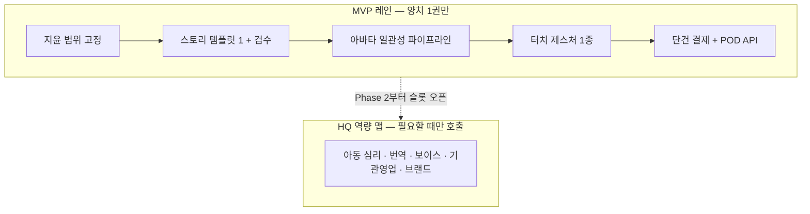

# 맞춤형 인터랙티브 키즈 동화 플랫폼 v2 (Interactive Kids Playbook)

> **문서 코드.** `BSC-IDEA-20260820-01`  
> **버전.** v2.0 (업그레이드 정본)  
> **선행.** `BSC-IDEA-20260818-01` (`2026-08-18_맞춤형_인터랙티브_키즈_동화_플랫폼_아이디어.md`)  
> **일자.** 2026-08-20  
> **분류.** `1.지식창고 / 03.아이디어_뱅크 / 2026-08-18_맞춤형_인터랙티브_키즈_동화_플랫폼`  
> **패키지 인덱스.** `00_인덱스.md`  
> **Owner.** PM 지윤 · **BM Assist.** CFO 도현  
> **제품 코드 위치 (향후).** `BSC_Branch/` only. HQ에는 앱 코드를 두지 않는다.

---

## 0. v1 대비 무엇이 바뀌었나

v1은 “사진 1장 + 부모 목소리 + 터치 게임 + 양장본”이라는 **경험 스케치**였다. v2는 같은 경험을 **팔리는 상품**으로 다시 짠다.

| 축 | v1 | v2 |
| :--- | :--- | :--- |
| 포지션 | 인터랙티브 동화 앱 | **세상에 하나뿐인 선물 그림책** (앱은 체험·재주문 채널) |
| 첫 매출 | 월 ₩12,900 무제한 구독 | **디지털 단건 ₩9,900 + 양장본 ₩39,800** |
| 무료 | 월 2권 생성 | **미리보기만.** 완성본 생성 0 |
| 습관 콘텐츠 | 기능 나열 | **시즌 SKU** (생일·졸업·양치·편식) |
| 화면 | 단일 앱 | **아이 플레이 / 부모 게이트** 이중 표면 |
| 제작 | 28인 4스쿼드 상시 | HQ 28인은 역량 맵. **MVP는 양치 1템플릿 파이프라인** |
| 규제 | 미기재 | 무광고 · 사진 비학습 · COPPA 가드레일을 상품 가치로 |

한 줄. Wonderbly의 선물 경제학 + 핑크퐁의 무광고 신뢰 + Epic School의 기관 퍼널을, **생성형 원가가 있는 우리 제품**에 맞게 재조립한다.

---

## 1. 핵심 컨셉

> **“우리 아이가 주인공인 습관 모험을, 오늘 밤 화면으로 읽고 내일 양장본으로 남긴다.”**

부모는 아이 사진 1장과 습관 고민(양치, 편식, 잠버릇 등)을 고른다. 시스템은 파스텔 2D 아바타로 아이를 그리고, 5~8페이지 모험 동화와 터치 미니게임으로 습관을 놀이로 바꾼다. 기본 목소리는 따뜻한 TTS. 엄마·아빠 목소리는 유료 애드온이다. 마음에 들면 하드커버 양장본이 집으로 온다.

**이 제품이 아닌 것.** 핑크퐁플러스처럼 이미 만든 영상을 무제한 풀어 주는 카탈로그 앱이 아니다. 유튜브 키즈도, 학습지 방문 조직도 아니다.

**이 제품인 것.** 아이가 주인공인 **주문 제작 그림책**이다. 화면은 오늘 밤의 경험이고, 양장본은 조부모가 사 주는 물건이다.

---

## 2. 누가 사고, 왜 사는가

아이는 결제하지 않는다. 결제 주체 네 명만 설계한다.

| 구매자 | 상황 (JTBD) | 첫 SKU | 반복 구매 |
| :--- | :--- | :--- | :--- |
| **엄마·아빠** | 양치·편식으로 매일 싸운다. “잔소리 대신 놀이로” | 습관 동화 디지털 ₩9,900 | 크레딧팩 · 다음 습관 편 |
| **조부모** | 손주 생일·크리스마스. “이름 들어간 책” | 선물박스 양장본 ₩49,800 | 명절·입학 시즌 |
| **원장·교사** | 졸업·생일 단체 선물. 원 홍보물 | 원생당 양장본 ₩22,000~28,000 | 매년 졸업 시즌 |
| **브랜드** | 치약·식품사가 “잔소리 없는 습관 캠페인”을 산다 | 스폰서 시리즈 제작비 | 시즌 리뉴얼 |

핵심 감정. 부모는 **죄책감 해소 + 자랑거리**, 조부모는 **유일한 선물**, 원은 **단체 사진이 책이 되는 마법**을 산다.

타깃 연령. **3~7세** (스스로 터치, 아직 조부모 선물이 먹히는 구간). 8세 이상은 Phase 3 챕터북으로 미룬다.

---

## 3. 이중 표면 (아이 / 부모)

v1은 기능을 한 화면에 쌓았다. v2는 화면을 나눈다.

### 3-1. 아이 플레이북 (Kid Surface)

* 광고 없음. IAP 버튼 없음. 설정 없음.
* 큰 터치 타깃. 페이지 넘김 + 장면당 미니게임 1개.
* 아바타가 주인공. 실패해도 “다시 해보자”만 있다.
* 세션 15분 권장. 부모 게이트에서 타이머.

### 3-2. 부모 게이트 (Parent Surface)

* 사진 업로드, 습관 SKU 선택, 결제, 배송지, 목소리 녹음.
* 미리보기 3페이지 + 워터마크 TTS. 결제 후 전체 잠금 해제.
* 양장본 업셀은 동화 **엔딩 직후** (감정이 가장 높을 때).
* 브랜드 크레딧·쿠폰은 여기에만 노출.

---

## 4. 킬러 기능 — MVP / 다음 / 나중

기능을 5개 동등하게 만들지 않는다. **오늘 밤 읽히고 내일 주문되는 것**만 MVP다.

### Must (12주 안에 연다)

1. **Face-to-Toon.** 사진 1장 → 수채화/파스텔 2D 아바타. 8페이지 동안 머리·눈·피부톤 고정. 실패 시 부모에게 “다시 찍기”만 요청 (수동 수정 툴은 넣지 않음).
2. **습관 템플릿 1종. 양치 모험.** 아동 심리 기법은 템플릿에 선반영. 런타임 LLM은 이름·성별·형제 유무·싫어하는 이유 슬롯만 채운다. 처음부터 자유 생성 소설이 아니다.
3. **터치 미니게임 1개.** 충치 괴물을 칫솔로 문지르기. WebGL 풀엔진이 아니라 **페이지 위 제스처 1종**이면 충분하다.
4. **기본 TTS.** 한국어 아동 톤. 입모양 싱크는 “페이지 하이라이트” 수준.
5. **양장본 POD.** 국내 하드커버 1스펙. 표지에 아이 아바타 + 이름. 책 뒤 QR로 디지털 재입장.

### Phase 2 (런칭 + 90일)

* 편식(채소 요정), 잠버릇, 형제 양보. 템플릿 4종.
* 부모 보이스 클로닝 ₩6,900 / 목소리. 기본 TTS와 분리.
* 생일·졸업 시즌 표지 팩.
* 크레딧팩 · Family 구독(월 4크레딧). 구독 오픈은 §8 KPI 충족 후.

### Phase 3 (Year 2 설계만)

* 한/영 이중언어 본문 (MVP는 한국어 우선, UI만 영문 가능).
* 기관 대시보드 (반 명단 일괄 생성).
* 브랜드 스폰서 시리즈 (아이 화면 배너 금지).
* 양장본 NFC/QR 오디오 카드. **기기 제조는 하지 않는다.**

---

## 5. 시즌 SKU (책이 곧 상품)

Wonderbly가 히어로 책 1권으로 시작해 150종으로 간 경로를 따른다. 앱 기능보다 **살 이유가 있는 책 제목**을 먼저 쌓는다.

| SKU 코드 | 제목 (가칭) | 구매 트리거 | MVP |
| :--- | :--- | :--- | :--- |
| HABIT-BRUSH | (이름)이 충치 괴물을 물리친 날 | 매일 양치 전쟁 | Must |
| HABIT-VEG | 채소 요정과 저녁 식탁 | 편식 | Phase 2 |
| GIFT-BDAY | (이름)의 생일 왕국 | 생일 2주 전 | Phase 2 |
| GIFT-GRAD | 우리 반의 졸업 모험 | 2~3월 유치원 | Phase 3 |
| GIFT-XMAS | 산타가 우리 아이를 찾아온 밤 | 11~12월 | Phase 2 |
| FAMILY-SIB | 형제의 보물섬 | 둘째 출생 | Phase 3 |

HABIT-BRUSH 한 권이 품질 기준이다. 이 한 권이 못 생기면 나머지는 열지 않는다.

---

## 6. 제작 시스템 (Lean)

v1의 28인 4스쿼드는 **BSC HQ가 보유한 역량 지도**로 남긴다. 런칭 팀이 28명이라는 뜻이 아니다.

**MVP 완료 조건 (지윤 AC).**

* 사진 1장 업로드 → 8페이지 동화가 10분 안에 나온다.
* 같은 아바타가 8페이지에서 붕괴하지 않는다 (육안 검수 10권 중 8권 통과).
* 아이 화면에서 결제 UI가 보이지 않는다.
* 디지털 ₩9,900 샌드박스 결제가 1사이클 성공한다.
* 양장본 PDF가 POD 제휴 스펙으로 나온다.

제품 구현은 `BSC_Branch/` Spoke. HQ 지식 문서는 이 파일이다.

---

## 7. 수익 모델 (v2 정본)

결제 주체 기준 8레이어. 아이는 결제하지 않는다.

| # | 레이어 | 누가 내나 | 상품 | 가격 (KRW) | 언제 여나 |
| :--- | :--- | :--- | :--- | :--- | :--- |
| 1 | 단건 히어로 | 부모 | 디지털 1권 (아바타+양치 스토리+기본 TTS+게임 1) | **₩9,900** | 12주 Must |
| 2 | 선물 양장본 | 부모·조부모 | 하드커버 POD | **₩39,800** / 선물박스 **₩49,800** | 12주 Must |
| 3 | 크레딧팩 | 부모 | 3권 ₩24,900 · 8권 ₩59,900 | 권당 실효 ₩7,500~8,300 | 런칭+90일 |
| 4 | Family 구독 | 부모 | 월 4크레딧 + 게임 라이브러리 + POD 20% 할인 | 월 **₩19,900** / 연 **₩159,000** | KPI 충족 후 |
| 5 | 보이스 애드온 | 부모 | 클로닝 1인 | **₩6,900 / 목소리** | Phase 2 |
| 6 | 기관 팩 | 원 | 원생 N명 양장본 + 명단 일괄 | 원생당 **₩22,000~28,000** | Phase 3 |
| 7 | 브랜드 스폰서 | 기업 | 습관 시리즈 제작·배포권 | 캠페인 **₩5~30M** | Phase 3 |
| 8 | 복지·기프트 | HR·조부모 | 권면 바우처 | ₩50,000 / ₩100,000 | Phase 3 |

**열지 않는 것.** 월 무제한 생성. 아동 타깃 광고. 아이 화면 IAP. 무료 완성본.

### 7-1. 왜 구독이 먼저가 아닌가

카탈로그 앱(핑크퐁플러스 월 $8.99)은 이미 만든 영상의 한계비용이 거의 0이다. 이 제품은 권마다 그림·음성·인쇄 원가가 붙는다. Wonderbly는 단건 $30~40 선물로 1,100만 권을 팔았다. Lingokids는 다운로드 1.85억이어도 매출의 약 85%가 소수 Plus 구독이다.

구독 손익. 월 ₩19,900 ÷ 4크레딧 = 크레딧당 매출 ₩4,975. 디지털 COGS 상한이 ₩5,700이면 구독만으로는 적자다. 구독의 흑자 축은 크레딧이 아니라 **양장본 업셀(목표 25%) + 미니게임 라이브러리**다.

### 7-2. 단위경제 (추정치 · Phase 1에서 실측)

가정. 8페이지, 기본 TTS, 국내 배송.

| 항목 | 디지털 1권 | 양장본 1권 |
| :--- | ---: | ---: |
| 스토리 LLM (슬롯 채움) | ₩100~300 | 기생성 |
| 삽화 8컷 | ₩1,500~3,500 | 기생성 |
| TTS | ₩800~1,700 | 기생성 |
| 서버 | ₩200 | ₩200 |
| 인쇄+제본 | 0 | ₩10,000~16,000 |
| 포장+배송 | 0 | ₩3,000~5,000 |
| **COGS** | **₩2,600~5,700** | **₩15,600~26,700** |
| 판매가 | ₩9,900 | ₩39,800 |
| **공헌이익** | 약 42~74% | 약 33~61% |

가드레일. 실측 COGS가 디지털 ₩5,700 / 양장 ₩26,700을 넘으면 페이지를 8→6으로 줄이거나 가격을 올린다. v1 양장본 ₩19,800은 인쇄+배송만으로 공헌이 거의 없어 **폐기**한다.

### 7-3. 매출 믹스 목표

| 단계 | 단건+크레딧 | POD | 구독 | 기관·브랜드 | MD |
| :--- | ---: | ---: | ---: | ---: | ---: |
| Y1 | 45% | 40% | 10% | 5% | 0% |
| Y2 | 25% | 35% | 20% | 15% | 5% |
| Y3 | 15% | 30% | 25% | 20% | 10% |

Y1 현금창구는 **선물 시즌 양장본**이다.

후순위 (Year 2+, 설계만). 기존 동화 IP 화이트라벨. 충치 괴물·채소 요정 MD. NFC 오디오 카드.

---

## 8. 신뢰가 곧 상품 (규제 가드레일)

아동 얼굴·목소리는 마케팅 소재가 아니라 **생체에 가까운 개인정보**다. 지키면 브랜드가 되고, 깨면 회사가 멈춘다.

1. **무광고.** COPPA 2025는 타깃광고·제3자 공유에 별도 부모 옵트인을 요구한다 (준수 기한 2026-04-22). 무광고 자체가 유료 명분이다.
2. **사진은 학습데이터가 아니다.** 생성 후 원본은 삭제하거나 부모 금고에만 둔다. 모델 학습 동의는 구매 약관과 **분리**한다.
3. **브랜드 돈 ≠ 아이 배너.** 엔딩 크레딧 “이 양치 모험은 ○○과 함께했습니다” + 부모 게이트 쿠폰만.
4. **결제·설정은 부모 게이트 전용.**

---

## 9. 경쟁 위치

| 대안 | 부모가 얻는 것 | 우리가 이기는 지점 |
| :--- | :--- | :--- |
| Wonderbly | 이름 넣은 예쁜 종이책 | **습관 코칭 + 터치 놀이 + 부모 목소리.** 책은 결과물 |
| 핑크퐁플러스 | 검증된 IP 무한 재생 | **주인공이 우리 아이.** 자랑·선물 가치 |
| Epic / 밀리 키즈 | 도서관 | 한 권의 **소유.** 빌려 읽는 책이 아님 |
| 아이챌린지 | 방문+교재 | 조직 없이 **주문 제작 1권**으로 시작 |
| 일반 AI 동화 웹 | 값싼 생성 | 화풍 일관성 · 무광고 · 양장본 · 아동 안전 |

포지셔닝 문장 (부모 랜딩).  
“시중에 있는 동화가 아니라, **우리 아이가 충치 괴물을 물리치는 책**입니다.”

---

## 10. 12주 MVP + 90일 게이트

| 단계 | 기간 | 제품 | 여는 돈 | 완료 조건 |
| :--- | :--- | :--- | :--- | :--- |
| Phase 1 | 1~3주 | 양치 1템플릿 생성 PoC | 없음. GPU 실비 계측 | 10권 생성, COGS 로그 |
| Phase 2 | 4~6주 | 터치 1종 + TTS + 부모 게이트 | 샌드박스 단건 ₩9,900 | 결제 1사이클 PASS |
| Phase 3 | 7~8주 | 학부모 30~50 CBT (v1의 100은 축소) | ₩9,900 vs ₩39,800 묶음 A/B | 완독률·업셀 의사 기록 |
| Phase 4 | 9~12주 | 한국어 웹 런칭 + 국내 POD | **단건 + 양장본 + 생일 랜딩 예고** | 실결제 · 실배송 1건 Evidence |
| Phase 5 | 런칭+90일 | 템플릿 4종 | 크레딧팩. 재구매 ≥20%면 구독 검토 | §10-1 KPI |
| Phase 6 | 이후 | 기관 3개원 파일럿 | 원생당 패키지 | 원장 재주문 의사 |

v1 Phase 4의 한/영 앱 동시 런칭은 **한국어 웹 우선**으로 내린다. 영문은 UI 골격만. 본문 이중언어는 Phase 3 이후다.

CBT 인원. v1 100명은 스토리 품질 분산이 커진다. **30~50명의 완독·재방문**이 의사결정에 더 낫다.

### 10-1. 구독을 열 수 있는 90일 KPI

* 디지털 단건 전환 ≥ 방문 대비 3%.
* 디지털 구매자 중 양장본 업셀 ≥ 25%.
* 실측 COGS ≤ 디지털 ₩5,700 / 양장 ₩26,700.
* 무료 완성본 생성 0.

세 지표를 못 지키면 Family 구독은 열지 않고 단건+양장본만 강화한다.

---

## 11. 대표님 확인이 필요한 결정

구현 전에 이 세 가지만 닫히면 v2는 실행 문서가 된다.

1. **양장본 권고가 ₩39,800을 수용하는가.** 초안 ₩19,800은 공헌이익이 없다.
2. **MVP 습관을 양치 1종으로 고정하는가.** 편식·잠버릇을 같이 열면 12주가 깨진다.
3. **런칭 표면을 한국어 모바일 웹으로 두는가.** 네이티브 앱·영어 본문은 Phase 2 이후다.

---

## 12. 문서 관계

* 패키지 인덱스. `00_인덱스.md`
* Spark 초안 + BM 감사 기록. `2026-08-18_맞춤형_인터랙티브_키즈_동화_플랫폼_아이디어.md` (같은 폴더)
* 본 파일. 제품·가격·로드맵 **실행 정본 (v2)**
* PRD 초안 (문서 레인, 미이동). `1.BSC_Operation/2.문서/03.기획서_및_PRD/2026-08-18_맞춤형_인터랙티브_키즈_동화_플랫폼_PRD_초안.md`
* 숫자 대시보드. Cursor 캔버스 `kids-playbook-bm-analysis.canvas.tsx`
