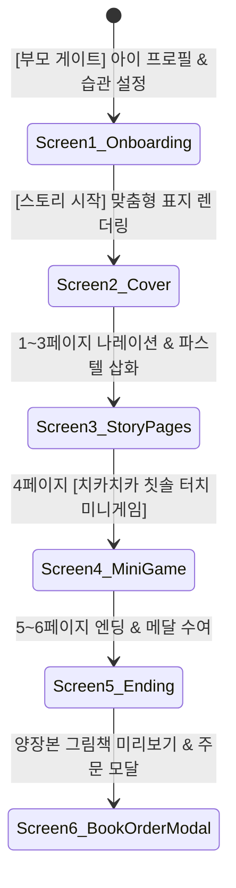

# 📱 KidStory 바이브코딩 프로토타입 상세 기획안

> **문서 코드.** `KIDSTORY-PROTOTYPE-SPEC-20260901`  
> **버전.** v1.0  
> **작성일.** 2026-09-01  
> **범위.** MVP 웹 프로토타입 (치카치카 행성의 용사 6P 완결형)  

---

## 1. 프로토타입 개발 목적 및 검증 가설

1. **검증 가설 1 (아이 몰입도)**: 
   - 자신의 이름이 들어간 동화와 터치 미니게임이 결합되었을 때, 3~7세 유아가 스토리에 끝까지 집중하는가?
2. **검증 가설 2 (부모 구매 의향)**: 
   - 디지털 인터랙티브 동화 경험 후, 실물 양장본 그림책(₩39,800)으로 소장하고자 하는 결제 전환 욕구가 발생하는가?
3. **바이브코딩 구현 목표**:
   - 브라우저에서 설치 없이 즉시 실행 가능한 **고감도 반응형 인터랙티브 웹 앱** 100% 작동 구현.

---

## 2. 화면별 와이어프레임 및 유저 플로우 (Screen Flow)

---

## 3. 화면별 상세 스펙 및 인수 기준 (AC)

### [화면 1] 부모 온보딩 & 맞춤 설정 (Parent Onboarding)
- **UI 요소**:
  - 아이 이름 입력 필드 (기본값: "민우", 실시간 반영)
  - 성별 및 나이(3~7세) 선택 라디오 버튼
  - 습관 테마 선택 카드: `[치카치카 양치질 🦷]` (MVP 선택), `[골고루 편식 개선 🥦]`, `[스르륵 잠버릇 🌙]`
  - 아바타 프리뷰 카드 (실시간 이름 및 헤어 스타일 변경 반영)
  - `[동화 시작하기 ✨]` 대형 펄스(Pulse) 액션 버튼
- **인수 기준 (AC)**:
  - 이름을 변경하면 동화 전편의 `{{CHILD_NAME}}` 변수가 0.1초 만에 즉시 치환되어야 함.

### [화면 2] 동화 커버 및 인트로 (Story Cover)
- **UI 요소**:
  - 4:3 비율의 따뜻한 파스텔 수채화풍 커버 캔버스
  - 입체적인 하드커버 책 테두리 및 그림자 효과
  - "책 열기 / 동화 듣기" 인터랙션 (터치 시 책장이 펼쳐지는 모션)

### [화면 3] 스토리 나레이션 뷰어 (1~3P, 5~6P)
- **UI 요소**:
  - 좌우 페이지 전환 버튼 (또는 모바일 스와이프 제스처)
  - 하단 반투명 블러 나레이션 박스
  - 오디오 재생기 (음성 합성 시뮬레이션 및 텍스트 하이라이팅)
  - 화면 터치 시 반짝이 별가루 파티클 효과

### [화면 4] 치카치카 터치 미니게임 (4P)
- **UI 요소**:
  - 캔버스 중앙에 귀여운 치아 성과 보라색 충치몬 5마리
  - 마우스 커서 또는 손가락 터치에 부드럽게 반응하는 마법 칫솔
  - 칫솔로 문지를 때마다 무지개 거품 생성 및 사운드 FX
  - 모든 충치몬 제거 시 "클리어!" 폭죽 이펙트 후 1.5초 뒤 다음 페이지 자동 이동

### [화면 5] 엔딩 및 양장본 그림책 주문 모달 (Ending & Order)
- **UI 요소**:
  - 아이에게 수여되는 "반짝 치카 용사 메달" 인터랙티브 회전 카드
  - "우리 아이의 첫 모험을 실물 양장본으로 평생 소장하세요" 카피
  - 3D 양장본 그림책 실물 미리보기 렌더링
  - `[₩39,800 양장본 주문하기]` / `[다시 읽기]` 액션
