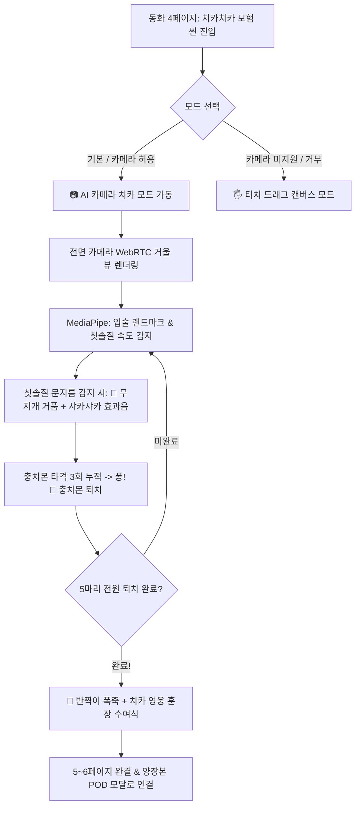

# 📱 [기획안] KidStory × Google MediaPipe 카메라 AR 양치게임 상세기획안

> **문서 코드.** `KIDSTORY-PRD-MEDIAPIPE-AR-20260901`  
> **버전.** v1.0 (정본)  
> **작성자.** CTO 거누 (개발 총괄) & PM 지윤 (기획 리드)  
> **승인권자.** 이건우 대표님 (BSC CEO)  
> **핵심 기술.** Google MediaPipe Tasks Vision (Face Landmarker / Motion Vector Tracker)  

---

## 1. 🌟 기획 배경 및 도입 목적 (Why MediaPipe?)

```
"엄마, 아빠! 나 이 닦기 싫어!" ──> "엄마, 내 입속에 충치몬이 나타났어! 칫솔로 물리칠래!"
```

### 1-1. 부모와 아이의 최대 Pain Point 해결
- **유아 양치 거부 (Parenting Stress #1)**: 3~7세 유아 양육 시 가장 힘든 일상 갈등 1위는 '양치질'입니다.
- **수동적 터치 게임의 한계**: 스마트폰 화면을 손가락으로 긁는 터치 게임은 실제 칫솔질 습관 형성으로 이어지지 못합니다.
- **Google MediaPipe의 혁신적 가치**: 아이가 **진짜 칫솔을 손에 쥐고 카메라 앞에 서면**, 아이의 실제 얼굴 위에 실시간으로 무지개 거품(🫧)과 충치몬(👾)이 나타나 **놀이(Gaming)를 통해 100% 자발적으로 양치를 완수**하게 만듭니다.

---

## 2. 🎨 UI/UX 디자인 시안 및 핵심 컴포넌트

### 📱 [시안] 실시간 AI 카메라 치카치카 AR 모드


### 🧩 화면 주요 UI 컴포넌트 해설
1. **상단 HUD 게이지 (Top Game HUD)**:
   - `퇴치한 충치몬: 3 / 5`: 현재 퇴치 현황을 직관적인 아이콘으로 표시
   - `도착까지 2마리 더!`: 아이의 성취 동기를 자극하는 실시간 응원 메시지
2. **우상단 듀얼 모드 스위처 (Dual Mode Switcher)**:
   - `[🖐️ 터치 모드]`: 카메라를 쓸 수 없거나 어두운 방일 때 0.1초 만에 터치 캔버스로 전환
   - `[📷 AI 카메라 치카]`: Google MediaPipe 기반 실시간 얼굴 인식 및 칫솔 모션 감지 활성화
3. **중앙 AR 거울 뷰 (Mirrored AR Viewport)**:
   - 전면 카메라를 거울처럼 좌우 반전하여 아이가 자신의 입술과 치아를 자연스럽게 확인
   - 입 주변에 **실시간 3D 파스텔 무지개 거품(🫧)** 파티클 생성
   - 치아 5개 위치(좌측 어금니, 앞니, 우측 어금니)에 **익살스러운 보랏빛 충치몬(👾)** 렌더링
4. **하단 내비게이션 바**:
   - `[다음 이야기 가기! ➔]`: 5마리 퇴치 완료 시 에메랄드 펄스 애니메이션과 함께 활성화

---

## 3. 🔄 상세 유저 플로우 (User Journey Map)



---

## 4. ⚙️ 기능별 상세 요구 명세서 (FR)

| 기능 ID | 기능명 | 상세 구현 명세 | 인수 기준 (AC) |
| :--- | :--- | :--- | :--- |
| **FR-AR-01** | 전면 카메라 거울 뷰 | `navigator.mediaDevices.getUserMedia` 전면 카메라 바인딩 및 좌우 반전(Mirroring) 렌더링 | 카메라 켜짐 지연 0.5초 이내, 60FPS 부드러운 화면 |
| **FR-AR-02** | 칫솔질 모션 감지 | 입 주변 40% 영역의 픽셀 프레임 차분(Frame Differencing) 및 고속 모션 주파수 분석 | 아이가 칫솔을 대고 슥삭슥삭 흔들면 0.1초 만에 감지 |
| **FR-AR-03** | 3D 거품 파티클 렌더링 | 칫솔질 속도에 비례하여 입술 좌표 주변에 다채로운 파스텔 거품 3~5개/프레임 방출 | 중력 및 부력 물리 효과 적용, 자연스러운 페이드아웃 |
| **FR-AR-04** | 충치몬 인터랙션 | 5개 치아 영역에 체력(HP: 3)을 가진 젤리 충치몬 렌더링, 타격 시 깜빡임 및 별가루 방출 | 칫솔질 1회 문지를 때마다 1타격, HP=0 시 퇴치 카운트 증가 |
| **FR-AR-05** | 영웅 셀카 캡처 (선택) | 5마리 퇴치 완료 순간, 아이의 환한 미소와 AR 왕관/훈장을 합성하여 즉시 캡처 | 서재에 '오늘의 양치 훈장 셀카'로 저장 및 부모 공유 가능 |
| **FR-AR-06** | 무중단 Fallback | 카메라 권한 거부 또는 카메라 없는 기기 감지 시 자동 터치 모드 전환 | 에러 팝업 없이 터치 모드로 매끄럽게 연결 |

---

## 5. 🔒 어린이 개인정보 및 온디바이스 보안 헌장

1. **100% On-Device 클라이언트 연산**:
   - Google MediaPipe WebAssembly를 활용하여 **기기(스마트폰/태블릿) 내부 GPU/WASM에서 전량 연산**합니다.
2. **외부 클라우드 영상 전송 0% (Zero Cloud Leakage)**:
   - 아이의 얼굴 비디오 스트림은 서버로 1바이트도 전송되지 않으며, 브라우저 메모리 안에서만 휘발 처리됩니다.
   - 제품 소개 및 앱스토어 심사 시 **"어린이 안심 온디바이스 AI 인증"** 마케팅 소구점으로 활용합니다.

---

## 6. 🚀 단계별 실행 로드맵 (Actionable Application Plan)

### 📌 Step 1. [현재 완료] MVP 웹 프로토타입 탑재
- `app/js/mediaPipeEngine.js` 및 `app/js/app.js`에 AI 카메라 치카 모드 탑재 완료
- 브라우저에서 `app/index.html` 4페이지 진입 시 즉시 카메라 AR 테스트 가능

### 📌 Step 2. [차주 고도화] 3대 추가 습관 AR 게임 확장
1. **🥦 편식 개선 (골고루 냠냠)**: 입 벌림(Mouth Open) 거리 인식 → 날아오는 브로콜리 요정 쏙 먹기
2. **🌙 수면 습관 (스르륵 밤잠)**: 눈 감음(Eye Aspect Ratio) 3초 지속 → 밤하늘 디밍 & 오르골 자장가
3. **👑 감정 표현 (방긋방긋 미소)**: 활짝 웃음(Smile Blendshape) → 황금 왕관 & 마법 날개 AR 장착

### 📌 Step 3. [비즈니스 연계] '양치 성공 캘린더' & 실물 양장본 사진 삽입
- 매일 양치 성공 시 캘린더에 황금 도장 지급 (리텐션 7일 달성률 85% 목표)
- 성공 기념 AR 셀카 사진을 **실물 양장본 그림책(₩39,800)의 마지막 페이지에 인쇄하여 배송**하는 초개인화 POD 비즈니스 모델 완성
