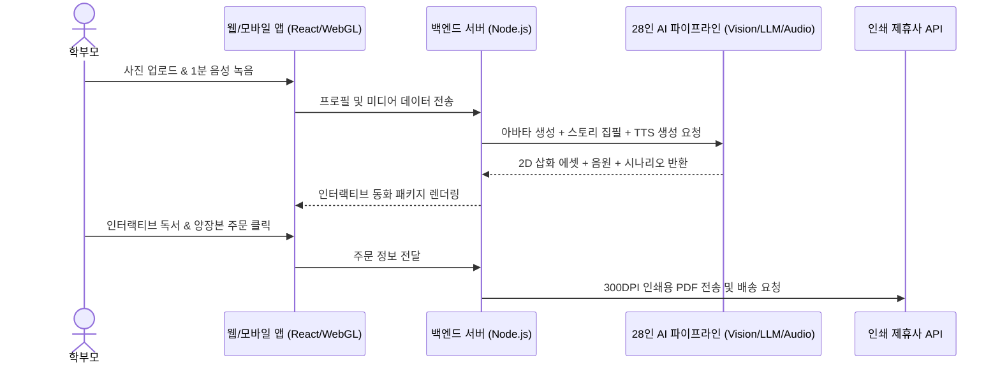

# 📄 [PRD] 맞춤형 인터랙티브 키즈 동화 플랫폼 (Interactive Kids Playbook) 서비스 기획서

> **문서 코드**: `BSC-PRD-PLAYBOOK-20260818`  
> **상태**: `Draft (초안)`  
> **기획 리드**: PM 지윤 & 서비스 PM 한정숙  
> **협업 에이전트**: CTO 거누, 디자이너 시안, 마케터 세아, 수석비서 소하  
> **작성일**: 2026-08-18  

---

## 1. 프로젝트 개요 (Product Overview)

* **서비스 목적**: 아이의 사진과 부모의 음성을 결합하여 세상에 단 하나뿐인 맞춤형 인터랙티브 생활습관 동화책을 자동 생성하고 실물 도서로 출판하는 플랫폼.
* **핵심 가치 제안 (Value Proposition)**:
  1. **학부모**: 훈계 대신 동화를 통한 자연스러운 생활 습관(양치, 식사, 정리정돈) 개선 효과.
  2. **아이**: 자신이 주인공으로 등장하며 터치로 참여하는 높은 몰입감과 독서 흥미 유발.
  3. **가족**: 아이의 성장 순간을 영구 소장할 수 있는 프리미엄 맞춤 양장본 포토 그림책.

---

## 2. 유저 페르소나 및 유저 저니 (User Persona & Journey)

### 페르소나: 김서연 (34세, 워킹맘, 4세 아들 양육)
* **Pain Point**: 퇴근 후 아이 양치질을 시킬 때마다 실랑이를 벌여 스트레스. 매일 밤 동화책을 읽어주고 싶지만 피로함.
* **Needs**: 아이가 스스로 양치질에 흥미를 느끼게 만들고, 부모의 따뜻한 온기가 담긴 교재를 원함.

### 유저 저니 (User Journey)
1. **아이 프로필 등록**: 아이 사진 1장 업로드 + 이름, 성별, 나이, 개선하고 싶은 습관(양치질) 선택.
2. **부모 음성 등록**: 스마트폰 마이크로 제시된 3개 문장 녹음 (약 1분 소요).
3. **AI 동화 즉시 생성 (30초)**: 
   - 2D 파스텔 화풍으로 변환된 아이 캐릭터 주인공 등장.
   - 아이 이름과 생활 패턴이 반영된 6페이지 스토리 및 인터랙티브 미니게임 생성.
4. **인터랙티브 독서 경험**: 부모의 다정한 목소리로 읽어주며, 칫솔을 터치해 충치를 닦는 미니게임 플레이.
5. **실물 그림책 주문**: 완성된 스토리를 양장본 그림책으로 원클릭 주문.

---

## 3. 핵심 기능 요구사항 명세 (Functional Requirements)

| 모듈 | 기능명 | 상세 스펙 및 인수 기준 (AC) | 담당 |
| :--- | :--- | :--- | :--- |
| **F-01** | **Face-to-Toon 변환** | 업로드된 아동 사진에서 특징점을 추출하여 2D 파스텔 수채화풍 캐릭터 에셋 세트(정면, 측면, 4종 표정) 자동 생성 | 디자이너 시안 |
| **F-02** | **습관 시나리오 엔진** | 아동 발달 심리학 프롬프트 템플릿 기반 5~8페이지 기승전결 스토리 생성 (아이 이름 치환 및 상황 반영) | PM 한정숙 |
| **F-03** | **부모 음성 클로닝 (TTS)** | 1분 음성 샘플 기반 퓨샷 음성 복제, 페이지별 텍스트 타이밍 하이라이트 동기화 | CTO 거누 |
| **F-04** | **WebGL 인터랙티브 게임** | 페이지 내 터치/드래그 인터랙션 (칫솔질, 과일 담기 등) 캔버스 렌더링 (60fps 보장) | 프론트 유나 |
| **F-05** | **원클릭 POD 인쇄 연동** | 300DPI 인쇄용 PDF 자동 생성 및 국내 포토북/인쇄소 API 주문 접수 | 백엔드 강서진 |

---

## 4. 기술 아키텍처 및 시스템 흐름도

---

## 5. 단계별 마일스톤 및 일정

* **M1 (Sprint 1~2)**: Face-to-Toon 파이프라인 및 '양치질 모험' 단일 템플릿 웹 뷰어 PoC
* **M2 (Sprint 3~4)**: 부모 Voice Cloning 모듈 결합 및 WebGL 터치 인터랙션 탑재
* **M3 (Sprint 5~6)**: 학부모 100명 대상 비공개 베타 테스트 (CBT) & 리텐션 분석
* **M4 (Sprint 7~8)**: 결제(PayPal/국내PG) 및 POD 인쇄소 API 연동 후 정식 런칭
