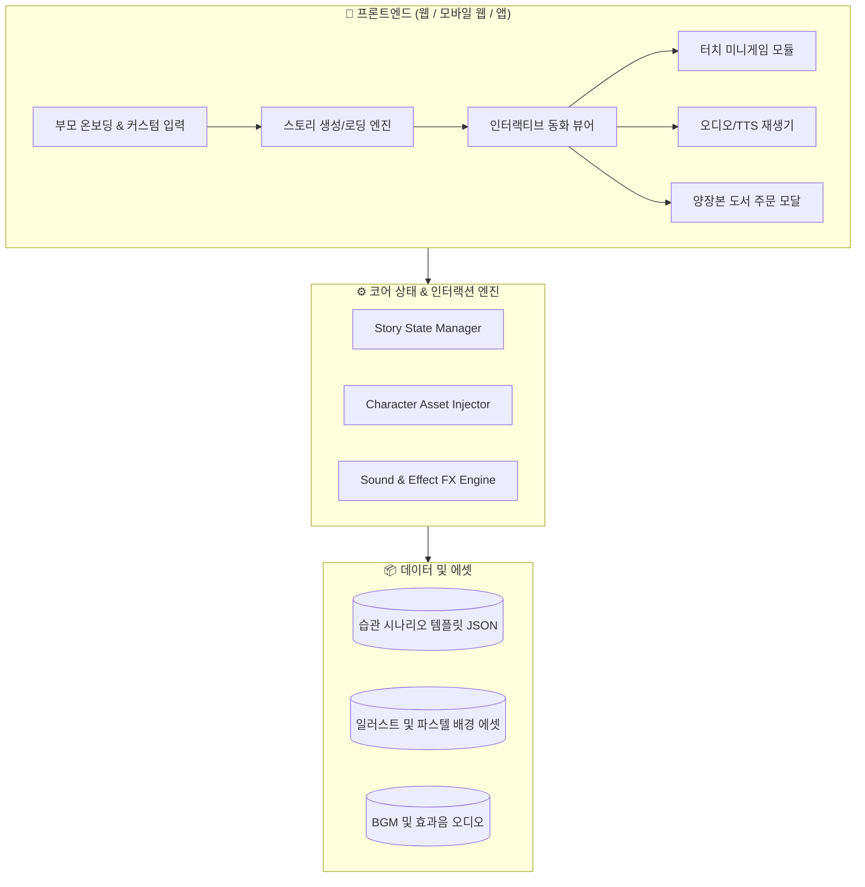

# 🏗️ KidStory 바이브코딩 프로토타입 아키텍처 설계서

> **문서 코드.** `KIDSTORY-ARCH-20260901`  
> **버전.** v1.0  
> **작성일.** 2026-09-01  
> **역할.** 프론트엔드/백엔드/인터랙션/AI 파이프라인 기술 설계  

---

## 1. 시스템 아키텍처 개요 (System Architecture)



---

## 2. 프론트엔드 인터랙션 스펙 (Frontend Interaction)

### (1) 이중 UI 구조 (Dual Interface)
1. **부모 게이트 (Parent Mode)**:
   - 아이 이름(예: "민우"), 성별, 연령(3~7세), 대상 습관(양치질, 편식, 정리정돈, 일찍 자기 등) 입력.
   - 캐릭터 커스터마이징 (헤어스타일, 의상 컬러, 안경 유무 또는 아바타 사진 업로드).
   - 목소리 톤 선택 (다정한 엄마 톤, 씩씩한 아빠 톤, 요정 나레이터).
2. **아이 플레이북 (Child Reader Mode)**:
   - 전면 전체화면 몰입형 UI (상하단 방해요소 최소화).
   - 넘김 애니메이션 (Page Flip 또는 Smooth Slide).
   - 대사 텍스트 하이라이트 (TTS 음성에 맞춰 현재 읽는 단어 강조).
   - 인터랙티브 파티클 (화면 터치 시 반짝이 별가루 및 비누거품 이펙트).

---

## 3. 인터랙티브 미니게임 통합 구조 (Mini-Game Engine)

* **씬(Scene) 중간 삽입 트리거**:
  - 동화 3~4페이지 도달 시 스토리와 자연스럽게 연결되는 10~20초 미니 인터랙션 실행.
* **MVP 대표 게임 (양치질 모험)**:
  - 거대 충치몬스터의 등장 → 아이가 화면 속 칫솔을 드래그하여 거품을 퐁퐁 터뜨림 → 깨끗해진 하얀 치아와 함께 승리 축하 사운드 재생 → 다음 페이지로 자동 전환.

---

## 4. 데이터 모델 설계 (Data Schema)

```typescript
export interface ChildProfile {
  id: string;
  name: string;
  age: number;
  gender: 'boy' | 'girl';
  avatarStyle: {
    skinTone: string;
    hairStyle: string;
    hairColor: string;
    clothColor: string;
  };
}

export interface StoryPage {
  pageNumber: number;
  layoutType: 'full_image' | 'split_top_bottom' | 'interactive_game';
  imagePrompt: string;
  backgroundImageUrl: string;
  characterPosition: { x: number; y: number; scale: number; animation: string };
  textLines: {
    korean: string;
    highlightTimingMs?: number[];
  }[];
  audioSrc?: string;
  interactiveGame?: {
    type: 'brush_teeth' | 'catch_vegetable' | 'clean_room';
    targetScore: number;
    clearMessage: string;
  };
}

export interface StoryBook {
  id: string;
  title: string;
  theme: 'habit_teeth' | 'habit_eat' | 'habit_sleep';
  totalPages: number;
  pages: StoryPage[];
}
```
