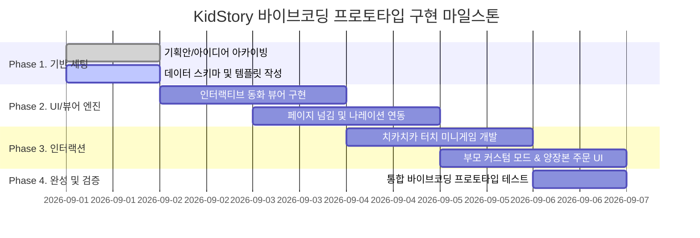

# 🗺️ KidStory 바이브코딩 단계별 구현 로드맵

> **문서 코드.** `KIDSTORY-ROADMAP-20260901`  
> **버전.** v1.0  
> **작성일.** 2026-09-01  

---

## 🎯 마일스톤 개요 (Milestones)

---

## 📋 단계별 세부 작업 내용

### Phase 1: 기반 세팅 및 데이터 에셋화 (Done / Active)
- [x] 스파크(Spark) 아이디어 및 PRD 기획안 복제 및 체계화
- [x] 연구 폴더 구조화 (`01_아이디어`, `02_기획안_PRD`, `03_바이브코딩_설계`, `04_스토리_에셋`)
- [x] MVP 1호 "치카치카 양치 모험" 6페이지 시나리오 JSON/MD 작성

### Phase 2: 인터랙티브 웹 뷰어 (Interactive Web Player)
- [ ] 반응형 키즈 뷰어 레이아웃 (모바일/태블릿/데스크톱 대응)
- [ ] 파스텔 일러스트 배경 및 캐릭터 렌더링
- [ ] 음성 나레이션(TTS/오디오) 싱크 및 텍스트 하이라이팅 효과

### Phase 3: 인터랙티브 터치 미니게임 & 부모 게이트
- [ ] 칫솔 드래그 / 터치 버블 애니메이션 미니게임 (HTML5 Canvas / CSS Animation)
- [ ] 아이 프로필(이름, 사진/아바타) 동적 치환 엔진
- [ ] 부모 전용 주문/설정 모달 (디지털 소장 & 실물 양장본 POD)

### Phase 4: 사용성 검증 및 피드백 루프
- [ ] 아이 시점 플레이 테스트 (조작 편의성, 몰입감)
- [ ] 양장본 인쇄용 PDF 렌더링 파이프라인 검토
