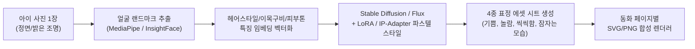
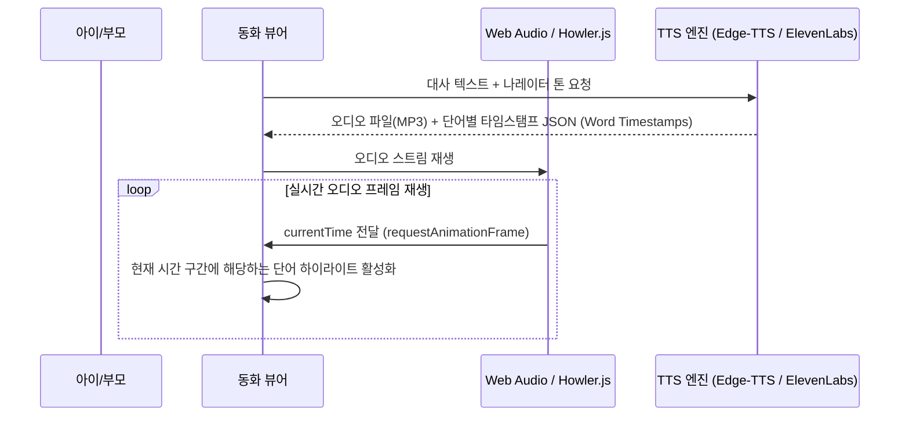

# ⚙️ KidStory 심화 기술 기획서 및 파이프라인 아키텍처

> **문서 코드.** `KIDSTORY-TECH-SPEC-20260901`  
> **버전.** v1.0  
> **작성일.** 2026-09-01  
> **핵심 영역.** Face-to-Toon AI 파이프라인, 음성 동기화 엔진, 캔버스 미니게임, POD 인쇄 엔진, 아동 프라이버시(COPPA)  

---

## 1. 2D 캐릭터 일관성 유지 파이프라인 (Face-to-Toon Pipeline)



### 핵심 기술 스펙
1. **IP-Adapter & Reference Control**:
   - 아이 얼굴의 고유 특징(눈매, 얼굴형, 헤어스타일)을 보존하면서 동일한 파스텔 수채화 화풍으로 6페이지 전편에 걸쳐 일관된 캐릭터 렌더링.
2. **2.5D 레이어 분리 합성 (Layered Compositing)**:
   - 배경(Background), 캐릭터(Character), 전경 인터랙션 오브젝트(Foreground Props)를 분리된 레이어로 렌더링하여 모바일 웹에서 부드러운 패럴랙스(Parallax) 및 모션 효과 부여.

---

## 2. 실시간 텍스트-음성 동기화 엔진 (TTS & Audio Sync Engine)



### 타임스탬프 데이터 구조 (Word Timestamp JSON)
```json
{
  "pageIndex": 1,
  "audioDuration": 5.4,
  "words": [
    { "word": "오늘", "start": 0.0, "end": 0.5 },
    { "word": "밤에도", "start": 0.5, "end": 1.1 },
    { "word": "민우는", "start": 1.1, "end": 1.7 },
    { "word": "달콤한", "start": 1.7, "end": 2.3 },
    { "word": "사탕을", "start": 2.3, "end": 2.9 },
    { "word": "먹었어요.", "start": 2.9, "end": 3.8 }
  ]
}
```

---

## 3. 인터랙티브 캔버스 미니게임 아키텍처 (Mini-Game Engine)

* **프레임워크**: HTML5 2D Canvas + Lightweight Physics / Pointer Events.
* **터치 & 드래그 인터랙션 처리**:
  1. `PointerDown` / `PointerMove`: 사용자의 터치 좌표를 캔버스 칫솔 오브젝트 좌표로 매핑.
  2. **Collision Detection (충돌 감지)**:
     - 칫솔 끝 좌표와 치아 성 위의 보라색 충치몬 Bounding Box 간의 충돌 검사.
     - 충돌 시 충치몬의 `health` 감소 (3회 타격 시 제거) 및 거품 파티클 인스턴스 20개 생성.
  3. **Particle FX Engine**:
     - 거품(Bubble): 부드러운 스케일업 후 팝(`pop`) 터짐 효과.
     - 별가루(Sparkle): 360도 회전하며 퍼지는 금빛 가루.
  4. **클리어 조건**:
     - 충치몬 5마리 전원 제거 시 캔버스 승리 모달 전환 및 0.8초 후 다음 동화 페이지로 자연스러운 트랜지션.

---

## 4. 실물 출판용 POD (Print-on-Demand) PDF 생성 엔진

* **사양**:
  - 규격: 210mm x 210mm 정사각형 하드커버 양장본 그림책.
  - 해상도: **300 DPI CMYK** (인쇄 품질 규격 보장).
  - 재단선: 사방 3mm 도련(Bleed) 영역 자동 포함.
* **렌더링 파이프라인**:
  - Node.js `Puppeteer` / `pdf-lib` 기반 고해상도 페이지 래스터화.
  - 벡터 폰트 임베딩 및 아이 맞춤형 속표지(부모의 메시지 + 아이 사진 증명서) 자동 합성.

---

## 5. 아동 개인정보 보호 및 안전 가드레일 (COPPA Architecture)

1. **Zero-Retention 정책**:
   - 업로드된 원본 아이 사진은 특징점(Feature Vector) 추출 및 일러스트 변환 즉시 메모리에서 영구 파기(No Permanent Raw Photo Storage).
2. **광고 및 외부 추적 차단**:
   - Google AdSense, 써드파티 트래커 일체 배제. 순수 100% 프라이빗 세션 보장.
3. **부모 게이트 검증 (Parental Verification)**:
   - 외부 링크 이동 또는 결제 시도 시 2자리 덧셈 연산 문제(예: 8 + 7 = 15) 필수 검증.
