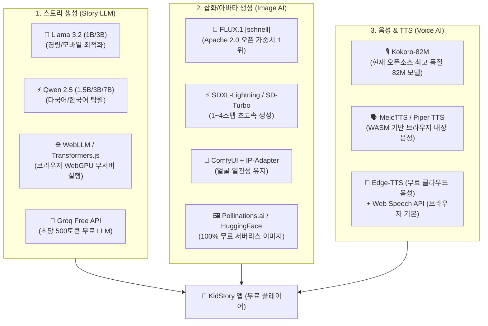

# 🤖 KidStory 오픈 모델(Open Models) 및 100% 무료 AI 파이프라인 설계서

> **문서 코드.** `KIDSTORY-OPEN-MODELS-20260901`  
> **버전.** v1.0  
> **작성일.** 2026-09-01  
> **핵심 과제.** **"서버 비용 0원, API 비용 0원으로 누구나 무료로 즐기는 인터랙티브 동화 시스템 구축"**  

---

## 🎯 1. 무료 & 오픈 모델 전략의 핵심 방향

> **"비용 장벽을 없애 사용자 유입을 극대화하고, 만족한 고객에게 실물 양장본(₩39,800)을 판매하는 프리미엄(Freemium) 선순환 구조"**

1. **완전 무료(Zero Cost) 레이어**:
   - 서버를 거치지 않고 사용자 브라우저(Client Side)나 무료 티어 API만으로 100% 작동.
2. **오픈소스 AI 모델(Open Weights) 중심**:
   - 빅테크(OpenAI 등) 유료 API에 종속되지 않고, 오픈소스 가중치를 활용해 독자적 서비스 구축.
3. **점진적 3단계 AI 아키텍처 (3-Tier AI Pipeline)**:
   - `Tier 0 (완전 무료/오프라인)` ➔ `Tier 1 (무료 오픈 AI API/WebGPU)` ➔ `Tier 2 (로컬 ComfyUI/Ollama)`

---

## 🗺️ 2. 분야별 추천 오픈 모델 생태계 맵



---

## 📊 3. 3대 영역별 오픈 모델 상세 스펙 및 적용법

### (1) 스토리 생성: 오픈 LLM 적용 방안
1. **무료 API 방식 (Groq / Google AI Studio)**:
   - **Groq Free Cloud**: `Llama-3.3-70B-Versatile`, `Llama-3.2-3B`를 초당 500토큰 이상의 초고속으로 **완전 무료(Free Tier)** 제공.
   - **Google AI Studio**: `Gemini 1.5 Flash` 분당 15회(15 RPM) 무료 호출 가능.
2. **브라우저 내장(In-Browser) WebLLM 방식**:
   - 사용자의 GPU(WebGPU)를 이용해 `Qwen2.5-1.5B-Instruct` 또는 `Llama-3.2-1B`를 브라우저 안에서 직접 구동 (서버 트래픽 비용 0원, 완벽한 아동 프라이버시).
3. **프롬프트 템플릿 구조**:
   - `[아동 발달 심리 룰셋]` + `[아이 이름/습관 변수]` + `[6페이지 기승전결 JSON 포맷 출력 강제]`.

---

### (2) 삽화 생성: 오픈 이미지 모델 적용 방안
1. **FLUX.1 [schnell] (Black Forest Labs)**:
   - **라이선스**: Apache 2.0 (상업적 이용 완전 무료).
   - **특징**: 4스텝만으로 미드저니급의 정교하고 따뜻한 일러스트 렌더링.
2. **무료 오픈 이미지 API (Pollinations.ai / Hugging Face Inference)**:
   - API 키나 결제 없이 `https://image.pollinations.ai/prompt/{prompt}` 호출만으로 파스텔 동화 삽화 실시간 생성.
   - 예시 프롬프트: `A cute 2D pastel watercolor children's storybook illustration of a 4yo boy brushing teeth with a magical glowing rainbow toothbrush, soft warm lighting, Pixar style --no harsh lines`
3. **비용 0원 하이브리드 (Vector SVG 캐릭터 레이어링)**:
   - 배경은 사전 렌더링된 고품질 파스텔 에셋을 쓰고, 아이 아바타(머리/옷/표정)만 SVG/Canvas로 실시간 합성하여 0.01초 렌더링 + 서버비 0원 실현.

---

### (3) 음성 구연(TTS): 오픈 보이스 모델 적용 방안
1. **Kokoro-82M (오픈소스 TTS 1위)**:
   - 모델 크기가 단 **82MB**에 불과하며 CPU에서도 실시간보다 4배 빠른 속도로 음성 합성.
   - 영어/한국어 등 고품질 목소리 생성 가능. 로컬 서버나 브라우저 WASM으로 패키징 가능.
2. **Edge-TTS (무료 고품질 음성 파이프라인)**:
   - Microsoft Edge의 고품질 인공지능 보이스(`ko-KR-SunHiNeural`, `ko-KR-InJoonNeural`)를 비용 없이 무료로 활용.
3. **Piper TTS (초경량 임베디드 TTS)**:
   - 라즈베리파이나 저사양 스마트폰 브라우저에서도 끊김 없이 작동하는 100% 오프라인 TTS.

---

## 🏗️ 4. 단계별 구현 및 무료 서비스 아키텍처

```
[Phase 1] 100% 브라우저 무료 모드 (현재 완성된 MVP)
  - 템플릿 기반 동적 스토리 치환
  - Web Audio API (사운드/효과음/BGM)
  - Web Speech API (브라우저 기본 한국어 TTS)
  - SVG/Canvas 2.5D 캐릭터 파티클 합성
  → 결과: 서버 비용 0원, 가입 없이 즉시 플레이

[Phase 2] 무료 오픈 AI API 연동 모드
  - Groq Free API / Gemini Flash 무료 티어로 무제한 자유 스토리 생성
  - Pollinations.ai / HuggingFace Inference 무료 삽화 생성
  - Edge-TTS 고품질 나레이터 음성 스트리밍
  - 사용자가 개인 무료 API Key를 입력하여 쓰거나 공용 무료 풀 활용

[Phase 3] 로컬 파워유저 모드 (Ollama + ComfyUI)
  - 내 컴퓨터에 설치된 Ollama (Llama 3.2) & ComfyUI (Flux/SDXL)를 웹 앱과 로컬 연결
  - 아이의 실제 사진으로 LoRA 학습 및 100% 닮은 고화질 그림책 무제한 자가 생산
```

---

## 💡 5. 비즈니스 전환 전략 (무료 ➔ 수익화)

* **무료 기능 (Freemium)**:
  - 웹에서 인터랙티브 동화 무제한 읽기 (무료)
  - 칫솔질 터치 미니게임 플레이 (무료)
  - 디지털 완성본 웹 뷰어 감상 (무료)
* **유료 전환 (Monetization)**:
  - **실물 하드커버 양장본 인쇄 & 배송**: **₩39,800** (원가 약 ₩12,000 → 건당 마진 약 ₩27,000)
  - **엄마/아빠 목소리 클로닝 애드온**: **₩4,900**
  - **고화질 PDF 다운로드 (출력용)**: **₩9,900**
